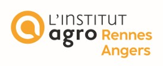
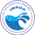

# formationIMROP

Ce package va regrouper differentes informations qui seront utilisées lors de la formation réalisée à l'Institut Mautitanien de Recherche Océanographique et des Pêches (IMROP) en Octobre 2024 par Jerome Guitton et Pablo Brosset du Pôle halieutique de l'Institut Agro Rennes-Angers. 
Cette formation est réalisée dans le cadre de l'appui de la coopération Allemande à l'institut. s

```
library(devtools)

devtools::install_github('polehalieutique/formationIMROP')
```

# Contenu du package
 
Ce package va permettre de diffuser des jeux de données qui seront utilisés lors de la formation




